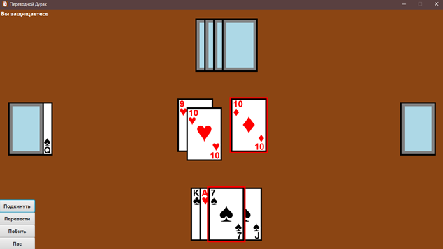

# Переводной Дурак  

## Описание проекта
Это классическая карточная игра, адаптированная для игры с ботом. Реализован минималистичный графический интерфейс, а также базовый искусственный интеллект для бота, учитывающий приоритеты действий и выбора карт.  

## Основной функционал  
1. **Игровой процесс:**  
   - Игра с ботом, карты игрока отображаются лицом вверх, карты бота — рубашкой.  
   - Поле включает колоду, козырную карту под ней, биту, карты на столе и карты в руках (игрока и бота).  
2. **Управление:**  
   - Карты выделяются кликом, повторный клик снимает выделение.  
   - Выделенные карты подсвечиваются красной обводкой и отображаются поверх остальных для удобства.  
   - Четыре кнопки для действий:  
     - "Подкинуть".  
     - "Перевести".  
     - "Побить".  
     - "Пас".  
3. **Искусственный интеллект бота:**  
   - Учитывает приоритеты действий:  
     - Стремится перевести, если есть возможность.  
     - При атаке выбирает наименьшую по значению карту, не козырь.  
     - При защите использует минимальную карту, которая может побить любую карту на столе.  

## Системные требования  
- Windows OS (тестировалось на Windows 10).    

---  
